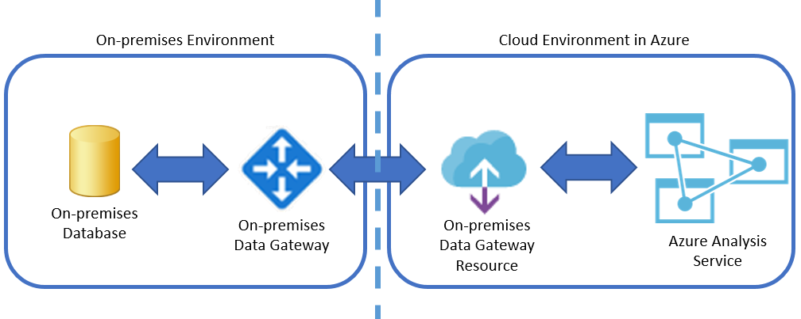
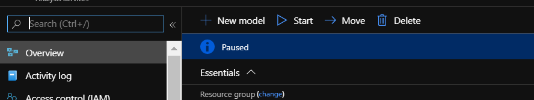
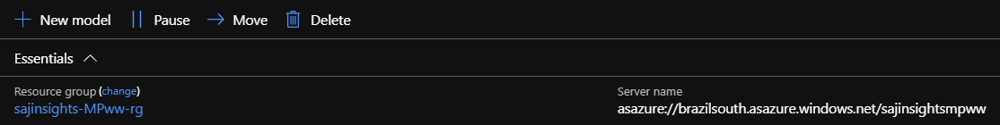
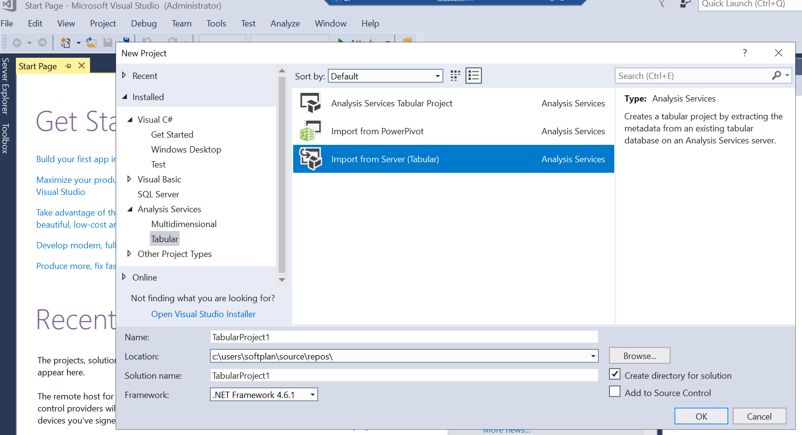
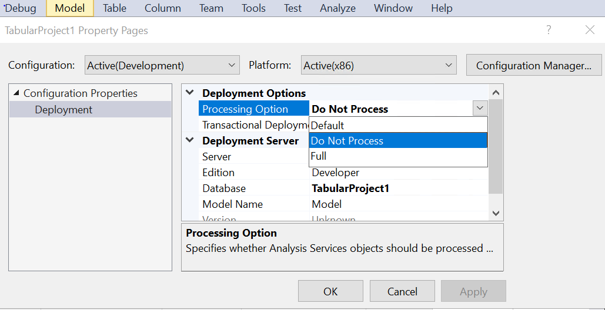

# Provisioning Services in the Cloud Environment
Software, libraries, configurations, and cloud resource provisioning become transparent to the user who will use this project.
The services provided with this project are:
- Resource Group
- Azure Analysis Services
- Azure Automation Account
- Azure Log Analytics
- Azure Storage Account

In addition, all scripts that support Azure Analysis Services are dynamically generated from a configuration file(`set_variables.tfvars`).

Below are the steps that must be followed to prepare the environment and run the automation:

1. Clone this project to the user's main directory on the on-premises server, example: `C:\Users\PRODUCT_NAME`
```powershell
cd ~
```
2. At the initial moment, you need to create and configure a user at Azure. Follow the
 [tutorial Azure](https://docs.microsoft.com/pt-br/azure/virtual-machines/linux/terraform-install-configure?toc=https%3A%2F%2Fdocs.microsoft.com%2Fpt-br%2Fazure%2Fterraform%2Ftoc.json&bc=https%3A%2F%2Fdocs.microsoft.com%2Fpt-br%2Fazure%2Fbread%2Ftoc.json) to create a user that terraform will use.

3. Once you have created a new user at Azure, set some parameters that will be used by the terraform. Open the file `set_variables.tfvars` which is at the root of the project and edit the variables.

Example of how to configure the file set_variables:
```HCL
# Azure
subscription_id = "11111111ffff-111b-111b-8a2e-11111111ffff"
client_id = "11111111ffff-111b-111b-8552-11111111ffff"
client_secret = "11111111ffff-111b-111b-9606-11111111ffff"
tenant_id = "11111111ffff-111b-111b-a933-11111111ffff"
6b02-494b-a933-1000020c0aad"

location = "brazilsouth"

tags =  {
    analytics = "bi"
    PRODUCT_NAME = "aa"
}

# User with access in portal Azure. Cannot be terraform user
application_user_login =  "application_user@PRODUCT_NAME.com.br"
application_user_password = "111b111b-111bd"

# Client and product name
client_name = "AA"
client_name_lower = "aa"
product_name = "PRODUCT_NAME"
product_client_name = "PRODUCT_NAME-MPAA"
product_client_name_lower = "PRODUCT_NAME-mpaa"

# If Runbooks fail, send email
email_from = "smtp@company.com.br"
email_to = "brunocampos01@gmail.com"
smtp_server = "email-smtp.com"
smtp_port = "587"

# Data source
data_source = "oracle"

# Analysis Services
large_volume_table = "fact_historic"
column_to_split = "id_column_name"
total_month = "18"

# Acess root in everyone databases of analysis services
list_admins_global = [
    "application_user@PRODUCT_NAME.com.br",
    "brunocampos01@gmail.com"
]

# Thes logins must be separeted without spaces
list_admins =  "brunocampos01@gmail.comr"
# Thes logins must be separeted without spaces
list_readers = "brunocampos01@gmail.com,application_user@PRODUCT_NAME.com.br"
```

3. Follow the step-by-step below to run automation correctly:
 - Open PowerShell as **admin**
 - Run the following commands on PowerShell:
```powershell
cd PRODUCT_NAME-mp/main
terraform init # download modules terraform
terraform plan -var-file="..\set_variables.tfvars" -out plan.out
terraform apply -var-file="..\set_variables.tfvars" -auto-approve -parallelism=1
```
- From now on the provisioning and configuration of the services will start in an automated way. Go to Manual Service Provisioning in the Cloud.


## Manual Service Provisioning in the Cloud
Once service provisioning has begun, you must perform a task within the cloud environment to provide scripting permission in the automation account. Follow the step-by-step below:
1. Access the [Azure](https://portal.azure.com/)
2. Inside the portal go to [Home > Automation-Accounts](https://portal.azure.com/#blade/HubsExtension/BrowseResource/resourceType/Microsoft.Automation%2FAutomationAccounts)
3. From the left menu, choose `Run as accounts` and confirm the creation of the certificate.

<br/>

### On-premises Data Gateways
On-premises Data Gateway is required to transfer the data from the data source to Azure Analysis Services.



To set it up it must first be done on the machine running the local Gateway. Then, do the steps below:

1. Access the [Azure](https://portal.azure.com/)
2. Wait about 15 minutes and then go to [Home > On-premises Data Gateways](https://portal.azure.com/#blade/HubsExtension/BrowseResourceBlade/resourceType/Microsoft.Web%2FconnectionGateways)
3. Click on them  `+ Add`
- In the table below are configuration suggestions

| Parameters        | Values                                 |
|-------------------|----------------------------------------|
| Resource Name     | <product_name>-<client_name>-gw        |
| Location          | Brazil South                           |
| Installation Name | <product_name>-<client_name>-onpremisesgw |

**NOTES**:
- It is important to use the same account that was logged into the data gateway on the local server.
- The _Installation Name_ field is the name of the local gateway, configured on the local server. It should appear in the list when you click the down arrow.

### Link Data Gateway with Azure Analysis Services
1. Access the [Azure](https://portal.azure.com/)
2. Inside the portal go to [Home > Analysis Services](https://portal.azure.com/#blade/HubsExtension/BrowseResourceBlade/resourceType/Microsoft.AnalysisServices%2Fservers)
3. From the left menu, choose **On-premises Data Gateway**
4. Now select the gateway from the list and then click on **Connect Gateway**


### Data Processing for Azure Analysis Services
After all services are created at Azure, approximately 15 minutes, the automation account runs an update runbook of the Powershell modules and then runs the creation of the Azure Analysis Services database.

As of 40 minutes, the database is already created. To be able to process data you need to set the data source password via Visual Studio (SSDT). Follow the step-by-step below:
1. Check that Azure Analysis Services is on. To do so, access the [Azure](https://portal.azure.com/)

2. Inside the portal go to [Home > Analysis Services](https://portal.azure.com/#blade/HubsExtension/BrowseResourceBlade/resourceType/Microsoft.AnalysisServices%2Fservers)



If it's paused, just click the **Start** and wait for the service to begin.

3. Copy the link as indicated in the image below.



4. Open the SSDT and start a new projectto

5. Choose the option: **Analysis Services > Import Tabular**  and renamed the project name to the standard  <product_name>-<client_name>



6. The endpoint of the database will then be requested. Then at this time paste the link copied from Azure and wait for the environment preparation.

7. In the right menu, open directory **Data Sources** and open the connection with 2 clicks. Enter the password of the source database and test the connection. If everything goes right, confirm and save the password..

8. To avoid having to bring the data into Visual Studio (SSDT), change the following project properties.
**Debug > TabularProject1 Properties > Deployment Options > Processing Option > Do Not Process**
In this same window, change the name of the **Server** field to Azure Analysis Services endpoint.
'


9. Build and deploy by clicking the **Start** button

10. Finished. The Azure Analysis Services database can now process data from data sources.

#### Automated Processing
From 55 min, if the data source password has been set, all partitions except the large volume partition will be processed through the automation account. In the sequence, the automation account creates and processes the large volume table partitions, makes a backup, and turns off Azure Analysis Services.

---

## Author
- Bruno Aurélio Rôzza de Moura Campos
<a href="https://github.com/brunocampos01" target="_blank"></a>
<a href="https://www.linkedin.com/in/brunocampos01/" target="_blank"></a>

## Copyright
<a rel="license" href="http://creativecommons.org/licenses/by-sa/4.0/"></a><br />This work by <span xmlns:cc="http://creativecommons.org/ns#" property="cc:attributionName">Bruno A. R. M. Campos</span> is licensed under a <a rel="license" href="http://creativecommons.org/licenses/by-sa/4.0/">Creative Commons Attribution-ShareAlike 4.0 International License</a>.

---
