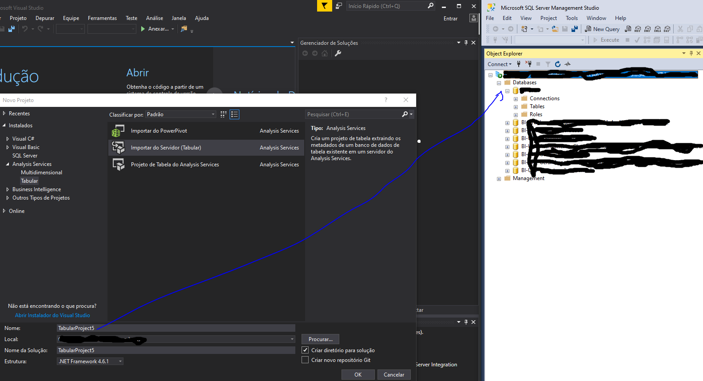
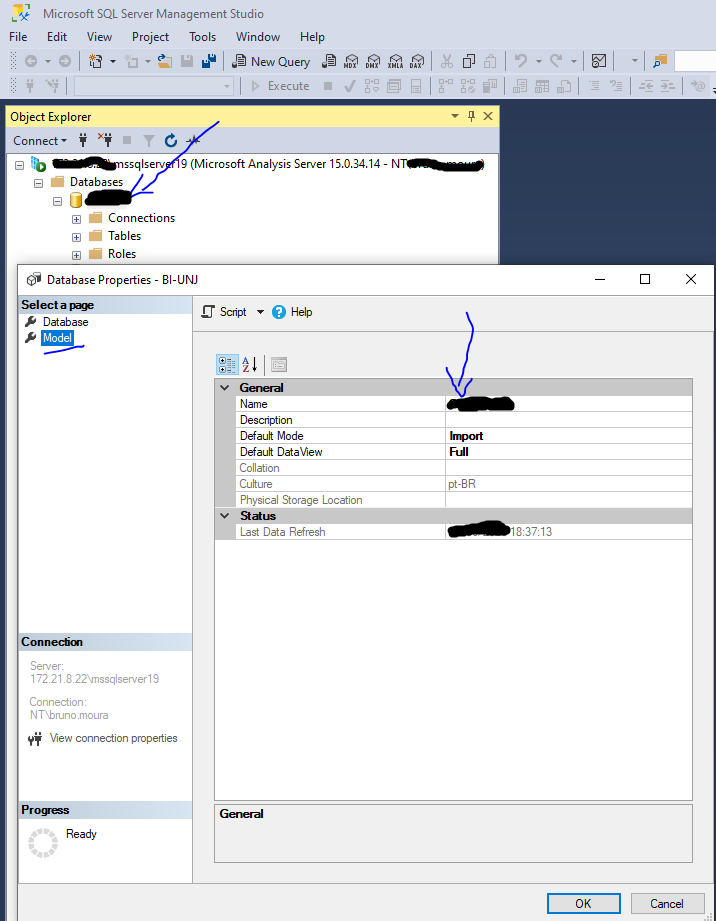

# SQL Server Analysis Services
O Analysis Services é um mecanismo de dados analíticos usado no suporte a decisões e análises de negócios.

### Pré-requisitos
- Microsoft SQL Sever Data Tools for Visual Studio 2017
- SQL Server Management Studio
- Power BI Desktop 
- Uma instância do Azure Analysis Services ou do SQL Server Analysis Services para implantar o modelo. 
- SQL Server Profiler. Útil porque é uma interface gráfica com o SQL Trace para monitorar uma instância do servidor.

### Como funciona o SSDT
Quando foi instalado o SSDT, vários novos itens de menu foram adicionados ao ambiente do Visual Studio. Vejamos aqueles específicos para a criação de modelos tabulares. Clique no menu modelo . A partir daqui, você pode iniciar o Assistente para Importação de Tabelas, exibir e editar conexões existentes, atualizar dados da área de trabalho, procurar seu modelo no Excel com o recurso Analisar no Excel, criar perspectivas e funções, selecionar a visualização do modelo e definir opções de cálculo.

Clique no menu tabela. Aqui, você pode criar e gerenciar relacionamentos entre tabelas, criar e gerenciar, especificar configurações da tabela de datas, criar partições e editar propriedades da tabela.

Clique no menu coluna. Aqui, você pode adicionar e excluir colunas em uma tabela, congelar colunas e especificar a ordem de classificação. Você também pode usar o recurso AutoSoma para criar uma medida de agregação padrão para uma coluna selecionada. Outros botões da barra de ferramentas fornecem acesso rápido aos recursos e comandos usados com freqüência.

#### Abas Importantes
- Explorador de modelo de tabela
  - O Tabular Model Explorer ajuda a navegar pelos objetos de metadados nos modelos tabulares.
- Solution Explorer
  -  mostra um contêiner lógico para um projeto de modelo tabular 

### Abrir um projeto do SSAS no SSDT
Este modelo pode ser usado para criar um novo projeto de modelo de tabela, extraindo os metadados de um modelo de tabela existente no Analysis Services.
 
Abaixo há um passo-a-passo detalhando como fazer:

1. Para criar um novo projeto de modelo tabular no SSDT vá em menu: Arquivo , clique em Novo > Projeto 
2. Na caixa de diálogo Novo Projeto , expanda Instalado > Analysis Services > Importar do Servidor Tabular.
3. Em Nome , digite o nome do projeto, geralmente é o nome do próprio banco de dados do SSAS.
> Na dúvida consulta o SSMS e confira os nomes de db do SSAS.
> Por padrão, o Nome da solução será igual ao nome do projeto; no entanto, você pode digitar um nome de solução diferente.
4. Clique em OK.

5. Na tela seguinte, digite o endereço do sevidor do SSAS e escolha o banco de dados

> exemplo
>
> - 192.168.1.1\mssqlserver19
>
> - BI-EXEMPLO

Depois que seu projeto é criado gerado, ele é aberto no SSDT. No lado direito, no Tabular Model Explorer , você verá uma visualização em árvore dos objetos em seu modelo. 

6. Clique na guia Solution Explorer. Aqui, você verá o arquivo Model`.bim`. O arquivo Model`.bim` contém todos os metadados para o seu projeto de modelo.
7. Clique com o botão direto do mouse em BI-UNJe vá em Propriedades.

8. Altere:
- Opção de Processamento: `full`
- Edição: `Enterprise: Licenciamento Baseado em Núcleo`
- Banco de dados: `veja no SSMS`
- Nome Modelo: `veja no SSMS`
9. Ainda no processo de preparação do projeto, abra a aba de Gerenciados de Soluções (Solution Explorer) e renomeie o arquivo (F2) model`.bim` para o nome correto do modelo (cubo).

> Abra o SSMS e clique com o botão direto no nome do projeto que vc abriu no SSDT. Depois vá em model. Na imagem abaico mostra como visualizar o nome do banco de dados e cubo (model) do projeto. 

10. Para finalizar, vá na aba Gerenciador de Modelos (caso esteja vazio, volte na aba Gerenciador de soluções e clique 2x no arquivo `.bim`) e clique em Fonte de dados. Na sequência, clique com o botão direto na fonte de dados

Será aberto a tela abaixo

11. Confira e preencha os dados de autenticação do SQL Server, Depois teste a conexão. Clique em salvar.
12. Agora veja a segurança, na aba Gerenciador de Modelos.

13. Será aberto a janela abaixo. Insira seu usuário e senha.

14. Para finalizar, faça um processamento local completo no botão indicado na imagem abaixo.

**O projeto do SSAS esta pronto para continuar o desenvolvimento.**

---

### Importar tabelas
1. Para importar tabelas, vá na aba gerenciador de modelos, explanda fonte de dados e clique com o botão direito do mouse encima da fonte de dados. Será aberto a tela abaixo:

2. Clique em Importar Novas tabelas. Depois será aberto a tela abaixo

3. Selecione a opção gravar uma consulta que expecificará os dados a serem importados. Depois insira uma intrução SQL com os dados formatados e renomeie a consulta para um nome amigável de consulta.
4. Clique em concluir

---

### Formatar colunas
Todas as colunas chave, geralmente començando com ID, devem ter a seguinte formatação:

- Pasta de exibição: `Colunas`

- Descrição: `nome da tabela na fonte de origem`

- Formato de dados: `Número Inteiro`

- Tipo de Dados: `Número Inteiro`

- Oculto: `True`

- Permitir valor nulo: `False`

- Resumir por: `Não resumir`

O restante das colunas devem ser observadas as seguintes formatações:

- Pasta de exibição: `Colunas`

- Descrição: `nome da tabela na fonte de origem`

- Resumir por: `Não resumir`

### Formatar medidas
Todas as medidas devem ter a seguinte formatação:

- Pasta de exibição: `Colunas`

- Descrição: `a fórmula`

- Formato de dados: `depende da medida`

- Tipo de Dados: `depende da medida`

- Casas decimais: `2`

- Mostrar separador de milhar: `True`

### Criar Medidas
Para criar medidas, você usará a Grade de medidas . Por padrão, cada tabela possui uma grade de medida vazia; no entanto, você normalmente não criará medidas para todas as tabelas. A grade de medidas aparece abaixo de uma tabela no designer de modelo quando estiver no Data View. Para ocultar ou mostrar a grade de medidas de uma tabela, clique no menu Tabela e clique em Mostrar Grade de Medidas .

Você pode criar uma medida clicando em uma célula vazia na grade de medidas e digitando uma fórmula DAX na barra de fórmulas. Quando você clica em ENTER para concluir a fórmula, a medida será exibida na célula. Você também pode criar medidas usando uma função de agregação padrão clicando em uma coluna e, em seguida, clicando no botão AutoSoma ( ∑ ) na barra de ferramentas. As medidas criadas usando o recurso AutoSoma aparecerão na célula da grade de medidas diretamente abaixo da coluna, mas podem ser movidas.

---

## Lições Aprendidas
- Para as dimensões no ssas, traga as colunas com alias
- não adianta usar funções sobre as colunas como FORMAT(), CAST(), ... pois simplesmente o ssas não reconhece. Faça isso, pelo SSDT ou usando TMSL.
- No atual momento, a versão mais estável e com uma comunidade mais forte é para a versão 1200.

### Log do Servidor
As configurações de log são:

Fica em : `C:\mssqldata\Microsoft SQL Server 2019\MSAS15.MSSQLSERVER19\OLAP\Data\msmdsrv.log`

### Autenticação
O correto processo de autenticar no SSAS para poder enviar projetos ao servidor, é o seguinte:
1. Adicione o usuário, preferencialmente de aplicação, ao administrador do servidor SSAS

  - Abra o SSMS

  - Clique com o botão direito do mouse em instância do serviço de análise da Microsoft

  - Aponte para `Propriedades -> Segurança -> Administradores de servidor -> adicione a conta`.

2. Configure a fonte de dados
  
  - Abra a solução do cubo com o SSDT
  
  - Vá em `Propriedades da fonte de dados -> Configurações de segurança -> Informações de representação -> Use um nome de usuário e senha específicos do Windows`
  
  - Defina o nome de usuário e senha de administrador do servidor.

### SSMS
Não use o SQL Server Management Studio para gerenciar o banco de dados da área de trabalho enquanto o projeto estiver aberto no designer de modelo. Fazer isso pode levar à perda de dados.

### Principais referências para o SSAS
- [mssqltips](https://www.mssqltips.com/)
- [doc microsoft do SSAS](https://docs.microsoft.com/pt-br/analysis-services/?view=asallproducts-allversions)
- [doc microsoft do SQLSERVER](https://docs.microsoft.com/pt-br/sql/sql-server/?view=sql-server-ver15)
- [sqlbi](https://www.sqlbi.com/)
- [dicas](https://github.com/ktaranov/sqlserver-kit)
