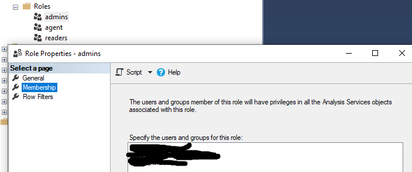

# Gerenciamento do SSMS

### Pré-requisitos
- Microsoft SQL Sever Data Tools for Visual Studio 2017
- SQL Server Management Studio
- Uma instância do Azure Analysis Services ou do SQL Server Analysis Services para implantar o modelo. 
- SQL Server Profiler. Útil porque é uma interface gráfica com o SQL Trace para monitorar uma instância do servidor.

### SSMS
Para quase todas as tarefas de gerenciamento, vc pode utilizar o SSMS.

### Parâmetros
- Observe que o SSAS armazena seus dados em arquivos (muitos arquivos - ele não possui nenhum mecanismo equivalente a grupos de arquivos), portanto, faz muito uso do cache do sistema de arquivos I/O para esses arquivos. Observe que o padrão para esses limites é de aproximadamente 60% da memória da máquina, respectivamente.

- Todos os dados de configuração residem em um arquivo chamado `msdmsrv.ini`. É um arquivo XML. Se você mexer na configuração através do SSMS (conecte-se ao servidor, clique com o botão direito do mouse no servidor, selecione propriedades), poderá definir opções que interromperão o servidor na inicialização. Tire uma cópia msmdsrv.iniantes de jogar com qualquer coisa.

#### Sobre a Autenticação
A autenticação é sempre a autenticação do Windows e a identidade do usuário é sempre o usuário do Windows que está se conectando por meio de Management Studio.

### Apagar Banco de dados


### Apagar Dados de um Banco de Dados


Altere o campos **Mode** para `process clear`


Em seguida confirme a operação, clicando em **OK**.

### Reprocessar Banco de dados


Altere o campos **Mode** para `process full`


### Analisar Permissões de Acesso

#### Permissões a nível de servidor 


#### Permissões a nível de Banco de dados

1. Clique 2x na pasta **Databases**

2. Em seguida, clique 2x no banco de dados que se deseja analisar as regras de autorização.

3. Agora, abra a pasta **Roles**

4. Clique com o botão direito do mouse na role de **Admins**. Esta regra contém todos os usuários que podem acessar, processar e ter o controle completo do banco de dados.

5. Será aberto um pop up, escolha a opção de **Properties**


Em seguida, selecione **Membership**



Não é uma boa prática alterar as permissões pelo SSMS. Se for preciso, faça pelo SSDT.

### Adicionar usuário no Banco de Dados do SSAS
- Pelo SSMS
- Adicionar usuário pelo arquivo `.bim`

#### Adicionar usuário pelo SSMS
Basta seguir as instruções do item **Permissões a nível de Banco de dados** e na última tela aparecerá um botão de **Add**.

#### Adicionar usuário pelo arquivo `.bim`
Para adicionar um usuário pelo arquivo `.bim` faça:
<br/>
1. *SSMS > Connect SSAS > Databases > Database > Roles > Properties*

2. Nesta tela clique em **Add**


3. Selecione os usuários para adicionar e clique em **OK**. 


3. Na tela abaixo, clique em **Script**. Vai ser gerado um código TMSL no SSMS.

```
{
  "createOrReplace": {
    "object": {
      "database": "BI-UNJ",
      "role": "admins"
    },
    "role": {
      "name": "admins",
      "modelPermission": "administrator",
      "members": [
        {
          "memberName": "NT\\carolina.campos",
          "memberId": "S-1-5-21-1973166965-1917654765-227697207-38299"
        },
        {
          "memberName": "app.insights@sajinsights.com.br",
          "memberId": "app.insights@sajinsights.com.br",
          "identityProvider": "AzureAD"
        },
        {
          "memberName": "NT\\app.indicadores",
          "memberId": "S-1-5-21-1973166965-1917654765-227697207-42222"
        }
      ]
    }
  }
}
```

4. Agora abra o arquivo `.bim` do SSAS e procure as roles
```
...

"roles": [
          {
            "name": "agent",
            "description": "integration services",
            "modelPermission": "administrator",
            "members": [
              {
                "memberName": "NT\\app.indicadores",
                "memberId": "S-1-5-80-1964583571-1947493333-99854565-3563786843-1541711243"
              }
            ]
          },
...
```

5. Adicione em `members` o memberName e o memberId

```
...

"roles": [
          {
            "name": "agent",
            "description": "integration services",
            "modelPermission": "administrator",
            "members": [
              {
                "memberName": "NT SERVICE\\SQLAgent$MSSQLSERVER19",
                "memberId": "S-1-5-80-1964583571-1947493333-99854565-3563786843-1541711243"
              },
              {
                "memberName": "NT\\app.indicadores",
                "memberId": "S-1-5-21-1973166965-1917654765-227697207-42222"
              }
            ]
          }
...
```

6. Agora salve o arquivo e abra o visual studio SSDT para ver as alterações.
